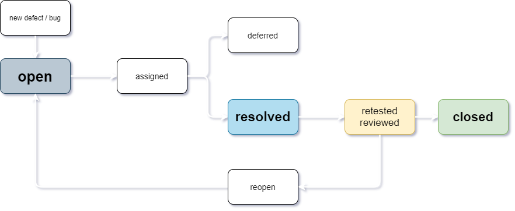
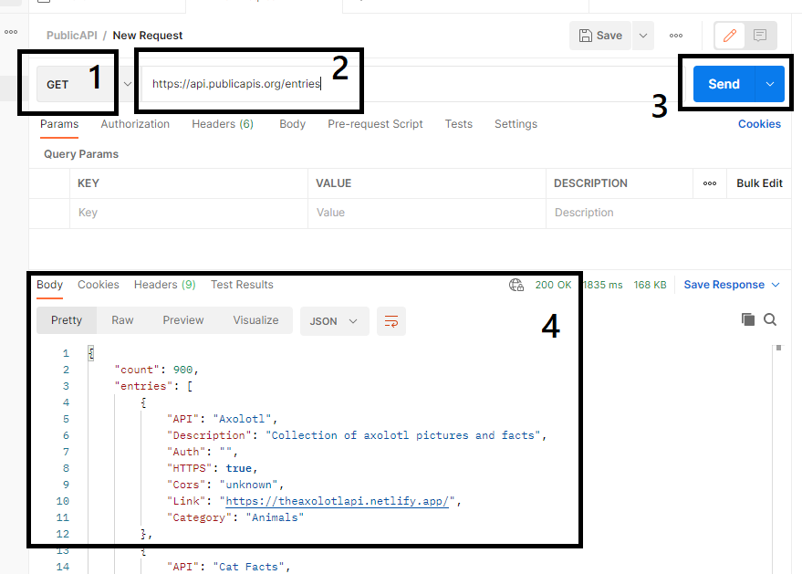
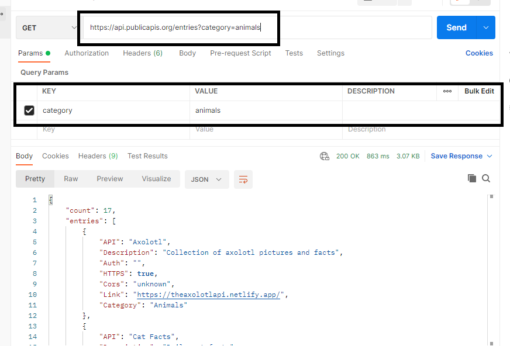

# CHALLENGE QA WRITTEN TEST

This challenge is submission for Cermati QA recruitement.
Submitted by Saarah Firdausy at 8/10/2021
Wish me luck^^

## Q1  What do you know about functional testing, integration testing, and performance testing / load testing ?

> Okay, so i know this question only asking three types of testing. But let me give you the whole picture. Software testing can be broken out into two different types: functional and non-functional testing. Integration testing is part of functional testing, while performance testing is part of non-functional testing. Why? Check out below.

### a. Functional Testing
Functional testing is carried out to check the business-critical features, functionality, and usability. Functional testing ensures that software features and functionalities are behaving as expected without any glitch. It mainly validates the entire application against specifications mentioned in the Software Requirement Specification (SRS) document. Types of functional tests include unit testing, interface testing, regression testing, sanity testing, and many.

#### Unit Testing
Unit testing focuses on testing individual parts/units of a software application early in the SDLC. Any function, procedure, method, or module can be a unit to undergo unit testing for determining its correctness and expected behavior. Unit testing is the first testing that developers perform during the development phase.

#### Integration Testing
Integration testing involves testing different modules of a software application as a group. A software application is made up of different submodules that work together for different functionalities. The purpose of integration testing is to validate the integration of different modules together and identify the bugs and issues related to them.
 
### b. Non-functional Testing
Non-functional testing, unlike functional testing, is to check that those functions work under load to observer performance, reliability, usability, scalability, etc. Non-functional testing, such as load and stress testing, is typically carried out using automation tools and solutions. In addition to performance testing, types of non-functional testing include stress testing, installation testing, reliability testing, and security testing.

#### Performance Testing
Performance testing is a type of non-functional testing, carried out to determine the speed, stability, and scalability of a software application. As the name suggests, the overall goal of this testing is to check the performance of an application against the different system and network benchmarks such as CPU utilization, page load speed, peak traffic handling, server resource utilization, etc. Within performance testing, there are several other testing types, such as load testing and stress testing.

---

## Q2 What do you do if you find bugs / application crashes during testing ?
> Of course, `raise the bug`. But seems this question is exploring the knowledge of how to pass this bug information to development team. Sure, let me introduce you to Bug Report. In the simplest way explanation, bug report is document that shout out 'This is what we have, this is what we should have instead, so fix it' to the developer.

### Bug report structure
| Parameter | Description |
| --- | --- |
| Bug ID | Unique Identifier |
| Title | short summary describe the bug |
| Date Author | well the date and the bug raiser |
| Test Item, Environment, Phase | what item, where is it |
| Step to reporduced | how to reproduced the bug |
| Expected Result | what it should be |
| Actual Result | what it is now (and it is wrong) |
| Severity | How bad |
| Priority | How urgent |
| Status | Will be explain in diagram below |
> The document example will be explained as I answer `Q4 Bug Report` question. Bear with me please.

*Status or Bug Journey*
The status name can be vary depends on team aggreement. But the basic one is `Open`, `Assigned`, `Deferred`, `Resolved`, `Reopen`, and `Closed` as you can see below



---

## Q3 Create a test scenario which has multiple test cases for the following features:

* As a user, I want to create a public gist.
* As a user, I want to edit an existing gist.
* As a user, I want to delete an existing gist.
The test cases should include as much detail as possible.

Here you go check this link > [Gitst Test Cases](https://docs.google.com/spreadsheets/d/1v3jSPo4d1-t011l2KXPyZsiYR9apg5hlBq4CVyVstyg/edit?usp=sharing)

---

## Q4 Go to http://www.shino.de/parkcalc/index.php? and report at least 2 bugs. Important: Mention all necessary fields which should be included in a bug.

> Trivia: You might wonder, why a bug is called a bug? Well it is because the term bug, describing a software error or failure goes way back to 1945. In late 1945, at the University of Harvard, a technical team found something unusual between points in Relay70. They found a real dead bug (the animal) which caused an error.

Here, the [Bug Report](https://docs.google.com/spreadsheets/d/1KUyIDTxytCra2WVUkgm4ng4qlWmnbtDbs1pmYt5Dr8s/edit?usp=sharing)
And also as the further example for the Q2

---

## Q5 Below is a public API along with its parameters
https://api.publicapis.org/entries?

* How many data entries are available for the category - Animals
* Return the link/URL of any website related to holidays

Okay so first thing first I explore this publicAPI. I go to https://github.com/davemachado/public-api. Where this cool guy Dave Machado store all information about his public API.

----
*his github repo looked like this*
### **GET** /entries
List all entries currently cataloged in the project

#### Parameters
Parameter | Type | Data Type | Description | Required
| --- | --- | --- | --- | --- |
| title | query | string | name of entry (matches via substring - i.e. "at" would return "cat" and "atlas") | No |
| description | query | string | description of entry (matches via substring) | No |
| auth | query | string | auth type of entry (can only be values matching in project or null) | No |
| https | query | bool | return entries that support HTTPS or not | No |
| cors | query | string | CORS support for entry ("yes", "no", or "unknown") | No |
| category | query | string | return entries of a specific category | No |

### **GET** /categories
List all categories
For categories like "Science & Math" which have a space and an ampersand, the query is simply the first word. Using "Science & Math" as an example, the correct query would be `category=science`

*end of his github repo*

---

>ok, now we know hot to send request to GET. Let me introduce you to postman. Here we acknowledge that GET requests are used to retrieve information from the given URL.




>we know the parameter we need is `category` of animals


1. Set your HTTP request to GET.
2. In the request URL field, input the link
3. Click Send
4. The results in the body are shown at the bottom



>voila, 17 data entries available of `category=animals`
>>and do the same way for `description holiday` we get

```json
{
    "count": 7,
    "entries": [
        {
            "API": "Abstract Public Holidays",
            "Description": "Data on national, regional, and religious holidays via API",
            "Auth": "apiKey",
            "HTTPS": true,
            "Cors": "yes",
            "Link": "https://www.abstractapi.com/holidays-api",
            "Category": "Calendar"
        },
        {
            "API": "Calendar Index",
            "Description": "Worldwide Holidays and Working Days",
            "Auth": "apiKey",
            "HTTPS": true,
            "Cors": "yes",
            "Link": "https://www.calendarindex.com/",
            "Category": "Calendar"
        },
        {
            "API": "Hebrew Calendar",
            "Description": "Convert between Gregorian and Hebrew, fetch Shabbat and Holiday times, etc",
            "Auth": "",
            "HTTPS": false,
            "Cors": "unknown",
            "Link": "https://www.hebcal.com/home/developer-apis",
            "Category": "Calendar"
        },
        {
            "API": "Holidays",
            "Description": "Historical data regarding holidays",
            "Auth": "apiKey",
            "HTTPS": true,
            "Cors": "unknown",
            "Link": "https://holidayapi.com/",
            "Category": "Calendar"
        },
        {
            "API": "Nager.Date",
            "Description": "Public holidays for more than 90 countries",
            "Auth": "",
            "HTTPS": true,
            "Cors": "no",
            "Link": "https://date.nager.at",
            "Category": "Calendar"
        },
        {
            "API": "Russian Calendar",
            "Description": "Check if a date is a Russian holiday or not",
            "Auth": "",
            "HTTPS": true,
            "Cors": "no",
            "Link": "https://github.com/egno/work-calendar",
            "Category": "Calendar"
        },
        {
            "API": "UK Bank Holidays",
            "Description": "Bank holidays in England and Wales, Scotland and Northern Ireland",
            "Auth": "",
            "HTTPS": true,
            "Cors": "unknown",
            "Link": "https://www.gov.uk/bank-holidays.json",
            "Category": "Calendar"
        }
    ]
}
```

---

## Q6 Create an automation script using any framework of your choice for the below scenario:

* Go to https://facebook.com 
* Enter all required fields (cover only positive cases) and register your account 

Here the [repo](https://github.com/sarsavira/cermati)
